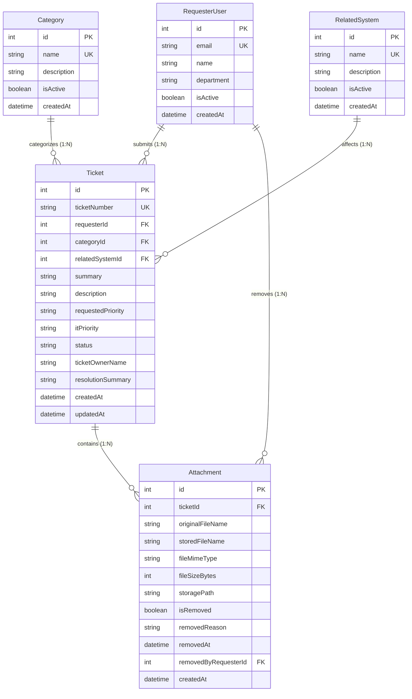

# Lab 2 Sprint Engineering Specification — TokTickIT Requester Ticketing MVP

## 1. Sprint Goal
Deliver a robust, responsive, and secure Requester-facing MVP for TokTickIT using the Zen Green design system. This increment enables end-user Requesters to select their development identity, submit IT support tickets with validated metadata and supporting attachments, search/filter/sort/paginate their personal tickets in "My Tickets", inspect read-only ticket details, and manage attachments with compliant soft-removal and download blocking—all backed by PostgreSQL and strict backend ownership enforcement, while intentionally deferring authentication and IT Staff workflows to Lab 3.

---

## 2. Stakeholder Request Interpretation
The IT Service Desk requires a modern web experience enabling employees (Requesters) to independently report issues and track their own support requests. Key capabilities requested:
1. **Ticket Creation**: Requesters describe an IT problem, select a Category and affected Related System, indicate Requested Priority, attach optional supporting evidence (up to 5 files, <= 5MB each), and submit.
2. **System-Generated Metadata**: The system automatically assigns a unique, immutable official Ticket Number (e.g., `TKT-2026-000001`), captures the submission timestamp, sets the initial status to `NEW`, and associates the ticket with the current Requester.
3. **Personal Ticket Management ("My Tickets")**: Requesters view only tickets they own, with real-time text search (ticket number/summary), multi-field filtering (category, priority, status), column sorting, and pagination.
4. **Ticket Inspection & Attachment Lifecycle**: Requesters view complete read-only ticket details and manage attachments. Requesters can download active attachments, upload supplementary attachments, or soft-remove attachments with a reason while retaining audit metadata (download access for soft-removed files is permanently revoked).
5. **Multi-User Ownership Simulation**: In the absence of full authentication (scheduled for Lab 3), a Development Requester Selector simulates user logins. Backend APIs must strictly enforce data isolation so one Requester cannot view, query, modify, or download tickets/attachments belonging to another Requester.
6. **Zen Green Design Language**: A unified, responsive design system (Desktop, Tablet, Mobile) with high accessibility, distinct read-only vs editable states, field-level validation, and rich user feedback for loading, empty, and error states.

---

## 3. Scope

### Included in Lab 2
* **Development Requester Simulation**:
  * PostgreSQL model and seed data for active and inactive Requesters.
  * Requester Selection screen & application header Requester switcher.
  * Client-side session context propagating `requesterId` to API calls.
* **Ticket Submission**:
  * Create Ticket form with live database reference data (Categories, Related Systems).
  * Field validation (required fields, character boundaries, allowed enum values).
  * Supporting file attachment upload during ticket creation or on the detail view.
  * Backend auto-generation of unique Ticket Number and initial status `NEW`.
* **Personal Ticket Dashboard ("My Tickets")**:
  * Server-side paginated list of tickets owned strictly by the active Requester.
  * Text search across Ticket Number and Summary.
  * Filtering by Category, Requested Priority, IT Priority, and Current Status.
  * Sorting by Ticket Number, Created Date, Summary, Category, Priority, Status, and Last Updated.
  * Responsive table (Desktop/Tablet) and card list (Mobile) with pagination controls.
  * Distinct empty state (zero tickets ever created) vs no-results state (filters matched zero items).
* **Requester Ticket Detail (Read-Only View Mode)**:
  * Comprehensive read-only view of ticket fields, classification, priority, status, and resolution summary placeholder.
  * Backend ownership verification returning HTTP 403/404 if accessed by a different Requester.
* **Attachment Lifecycle**:
  * Attachment validation: JPG/JPEG, PNG, WEBP, and PDF; maximum 5 MB per file; maximum 5 active attachments per ticket.
  * Safe file storage and filename sanitization.
  * Attachment download endpoint for active attachments.
  * Soft-removal mechanism: flags record as removed, records timestamp, reason, and requester identity; blocks subsequent download attempts (HTTP 410 Gone).
* **Zen Green UI & Responsive Layout**:
  * Full adherence to Zen Green design tokens, typography, button hierarchy, and badge schemes.
  * Fully responsive layouts tested across Desktop (>= 992px), Tablet (768–991px), and Mobile (< 768px).

### Excluded from Lab 2 (Deferred to Lab 3 or Later)
* **Authentication & Authorization**: Passwords, bcrypt hashing, JWT tokens, session cookies, OAuth, role-based access control (RBAC), user registration, password resets.
* **IT Staff Workflow**: IT Staff triage dashboard, unassigned queue, ticket assignment/claiming, updating IT Priority, changing Ticket Status, writing Resolution Summaries.
* **Ticket Status Lifecycle Beyond Creation**: Transitioning tickets from `NEW` to `OPEN`, `IN_PROGRESS`, `RESOLVED`, `CLOSED`, or `CANCELLED`.
* **Collaboration & Auditing Features**: Public comments, internal notes, Actions Taken timeline, email notifications.
* **Administrative Operations**: CRUD management of Categories, Related Systems, or Requesters.

---

## 4. Functional Requirements (FR)

### FR-01: Development Requester Selection & Context
* **Statement**: The system shall provide a Development Requester selector to choose an active development user to simulate the logged-in requester context across the application.
* **Related Business Rules**: `BR-03`, `BR-04`, `BR-05`
* **Related Acceptance Criteria**: `AC-01`, `AC-02`, `AC-20`
* **Definition of Done**: 
  - Database contains at least 4 active and 1 inactive seeded requesters.
  - Active requesters are fetched via `GET /api/requesters` and rendered in the selector.
  - Selecting a requester stores the identity in client state and updates the application shell.

### FR-02: Inactive Requester Exclusion
* **Statement**: Inactive Development Requesters (`isActive = false`) shall never appear in the selector dropdown and shall be forbidden from submitting tickets via API.
* **Related Business Rules**: `BR-05`
* **Related Acceptance Criteria**: `AC-01`
* **Definition of Done**:
  - API endpoint `GET /api/requesters` filters out records with `isActive: false`.
  - Backend ticket submission rejects requests with inactive `requesterId` with HTTP 403 Forbidden.

### FR-03: Reference Data Loading
* **Statement**: The system shall dynamically fetch and render active Categories and Related Systems from PostgreSQL to populate form dropdowns and list filters.
* **Related Business Rules**: `BR-08`, `BR-09`
* **Related Acceptance Criteria**: `AC-03`
* **Definition of Done**:
  - `GET /api/categories` returns the 4 seeded categories.
  - `GET /api/related-systems` returns at least 6 seeded related systems.
  - Dropdowns on Create Ticket and My Tickets render options correctly.

### FR-04: Ticket Creation & Submission
* **Statement**: An active Requester shall be able to submit a new IT support ticket by providing Category, Related System, Requested Priority, Summary, Description, and optional attachments.
* **Related Business Rules**: `BR-01`, `BR-02`, `BR-06`, `BR-07`, `BR-08`, `BR-15`, `BR-16`
* **Related Acceptance Criteria**: `AC-04`, `AC-05`, `AC-06`, `AC-21`
* **Definition of Done**:
  - Frontend form submits validated payload to `POST /api/tickets`.
  - On success, displays confirmation message with generated Ticket Number and redirects/links to My Tickets or Ticket Detail.

### FR-05: Backend Ticket Number & Metadata Generation
* **Statement**: The backend shall generate a unique official Ticket Number (`TKT-YYYY-NNNNNN`), assign initial status `NEW`, record `createdAt`, and bind the ticket to `requesterId`.
* **Related Business Rules**: `BR-01`, `BR-02`, `BR-04`
* **Related Acceptance Criteria**: `AC-04`
* **Definition of Done**:
  - Ticket Number is generated server-side with zero possibility of client override.
  - New ticket records in PostgreSQL have `status = "NEW"` and matching foreign keys.

### FR-06: Form Input Validation & Error Presentation
* **Statement**: The system shall validate all required fields on frontend and backend, enforcing length limits (Summary: 5–150 chars, Description: 10–2000 chars) and displaying inline field errors.
* **Related Business Rules**: `BR-06`, `BR-07`, `BR-16`, `BR-19`
* **Related Acceptance Criteria**: `AC-05`, `AC-06`, `AC-21`
* **Definition of Done**:
  - Invalid inputs show dark red `#B3261E` messages directly below the corresponding input.
  - Submissions with missing or out-of-bounds fields are blocked and never dispatch invalid requests.

### FR-07: Attachment Upload & File Constraints
* **Statement**: Requesters shall be able to attach supporting evidence adhering strictly to allowed formats (JPG, PNG, WEBP, PDF), size limits (<= 5 MB), and capacity limits (<= 5 active files per ticket).
* **Related Business Rules**: `BR-10`, `BR-11`, `BR-12`
* **Related Acceptance Criteria**: `AC-07`, `AC-08`
* **Definition of Done**:
  - Frontend file picker enforces format and size validation with instant feedback.
  - Backend multer/upload pipeline enforces MIME, size, and active attachment count checks, rejecting non-compliant uploads with HTTP 413/415/422.

### FR-08: Personal Ticket Listing ("My Tickets")
* **Statement**: The system shall display a paginated list of tickets belonging strictly to the currently selected Development Requester.
* **Related Business Rules**: `BR-04`, `BR-17`, `BR-18`
* **Related Acceptance Criteria**: `AC-09`, `AC-14`
* **Definition of Done**:
  - `GET /api/tickets?requesterId=<id>` queries only records where `ticket.requesterId == id`.
  - Switching requesters refreshes the list with total isolation between users.

### FR-09: Ticket Search & Multi-Field Filtering
* **Statement**: Requesters shall be able to search tickets by keyword (matching Ticket Number or Summary) and filter by Category, Requested Priority, IT Priority, and Status.
* **Related Business Rules**: `BR-17`
* **Related Acceptance Criteria**: `AC-11`, `AC-12`, `AC-15`
* **Definition of Done**:
  - Backend supports combinable query parameters (`search`, `categoryId`, `requestedPriority`, `itPriority`, `status`).
  - Filter bar in UI updates ticket list dynamically and displays "No-results" state when zero matches occur.

### FR-10: Ticket Sorting & Pagination
* **Statement**: The system shall support sorting tickets by specified columns (default: `createdAt DESC`) and navigating across paginated pages with configurable page sizes.
* **Related Business Rules**: `BR-18`
* **Related Acceptance Criteria**: `AC-10`, `AC-13`
* **Definition of Done**:
  - API returns structured `{ data, pagination }` payload.
  - Pagination controls allow navigation between pages with accessible Next/Prev buttons.

### FR-11: Ticket Detail Read-Only Inspection
* **Statement**: The system shall provide a dedicated read-only screen displaying complete ticket information, classification, badges, summary, description, and attached files.
* **Related Business Rules**: `BR-04`, `BR-09`
* **Related Acceptance Criteria**: `AC-16`
* **Definition of Done**:
  - Screen renders all ticket header fields with `#F0F4F1` read-only container styling.
  - Non-editable controls have appropriate cursors and cannot be modified by the requester.

### FR-12: Backend Ownership Enforcement
* **Statement**: The backend API shall enforce ownership isolation on every single-ticket detail request, attachment upload, download, and soft-removal operation.
* **Related Business Rules**: `BR-04`
* **Related Acceptance Criteria**: `AC-09`, `AC-10`, `AC-20`
* **Definition of Done**:
  - Any request targeting a ticket or attachment owned by another requester returns HTTP 403 Forbidden or HTTP 404 Not Found.
  - Cross-user data leakage is provably blocked at the API layer.

### FR-13: Active Attachment Download
* **Statement**: Requesters shall be able to download any active attachment associated with a ticket they own.
* **Related Business Rules**: `BR-04`, `BR-13`
* **Related Acceptance Criteria**: `AC-17`
* **Definition of Done**:
  - Endpoint `GET /api/attachments/:id/download` verifies ownership and streams binary file with original filename.

### FR-14: Attachment Soft Removal with Audit Reason
* **Statement**: Requesters shall be able to soft-remove an attachment from an owned ticket by providing an optional/required reason, retaining metadata without deleting the file.
* **Related Business Rules**: `BR-13`, `BR-14`
* **Related Acceptance Criteria**: `AC-18`
* **Definition of Done**:
  - Deletion triggers a confirmation modal.
  - Backend updates `isRemoved = true`, `removedAt = NOW()`, `removedReason`, and `removedByRequesterId`.
  - Active attachment count decreases by 1.

### FR-15: Blocked Download of Removed Attachments
* **Statement**: Any attempt to download a soft-removed attachment shall be strictly blocked, returning HTTP 410 Gone.
* **Related Business Rules**: `BR-14`
* **Related Acceptance Criteria**: `AC-19`
* **Definition of Done**:
  - API download endpoint checks `attachment.isRemoved` and returns HTTP 410 Gone if true.
  - UI displays strikethrough filename, "Removed" badge, and disabled download button.

### FR-16: Requester Switching & Dynamic Refresh
* **Statement**: When the user switches the active Development Requester in the header, the entire UI shall immediately reload context and data for the new requester.
* **Related Business Rules**: `BR-03`, `BR-04`
* **Related Acceptance Criteria**: `AC-20`
* **Definition of Done**:
  - Switching requester updates `localStorage` and triggers full re-fetch of tickets in My Tickets.
  - Zero state or data from previous requester remains visible.

---

## 5. Business Rules (BR)

* **BR-01: Backend Ticket Number Generation**
  The official Ticket Number must be generated exclusively by the backend upon persistence. The format is `TKT-YYYY-NNNNNN` (e.g. `TKT-2026-000001`), where `YYYY` is the current year and `NNNNNN` is a zero-padded unique sequence or random collision-checked counter. The Ticket Number is immutable and read-only.
* **BR-02: Initial Ticket Status**
  Every newly created ticket must be initialized with status `NEW`. Requesters cannot select or alter ticket status.
* **BR-03: Development Identity Limitation**
  The Development Requester selector is strictly a testing harness to simulate multi-user data isolation. It does not provide cryptographic authentication, session security, or password verification.
* **BR-04: Strict Ownership Isolation**
  A Requester may only list, view, attach files to, download attachments from, or soft-remove attachments on tickets where `ticket.requesterId == currentRequester.id`. Cross-user data leakage at the API layer is a critical defect.
* **BR-05: Inactive Requesters Ineligible**
  Requesters flagged with `isActive = false` cannot be selected in the UI and cannot author tickets via API (API returns HTTP 400/403).
* **BR-06: Summary Field Constraints**
  Ticket Summary is mandatory, must be trimmed of leading/trailing whitespace, and must be between 5 and 150 characters in length.
* **BR-07: Description Field Constraints**
  Ticket Description is mandatory, must be trimmed of leading/trailing whitespace, and must be between 10 and 2000 characters in length.
* **BR-08: Requested Priority Domain**
  Requested Priority is required and must be one of the predefined domain values: `LOW`, `MEDIUM`, `HIGH`, `URGENT`. Default selection in Create Ticket is `MEDIUM`.
* **BR-09: IT Priority & Ticket Owner Defaults**
  Upon creation, `itPriority` is initialized to `UNASSIGNED` (or null/matching requested pending triage) and `ticketOwnerId` is `null` (unassigned). These fields are read-only for Requesters.
* **BR-10: Allowed Attachment Specifications**
  Only files with MIME types `image/jpeg`, `image/png`, `image/webp`, and `application/pdf` are accepted. Files with any other extension or MIME type must be rejected with HTTP 415 (Unsupported Media Type).
* **BR-11: Attachment Size Limits**
  Individual attachment file size must not exceed 5,242,880 bytes (5 MB). Files exceeding this limit must be rejected with HTTP 413 (Payload Too Large).
* **BR-12: Maximum Active Attachments Per Ticket**
  A single ticket may possess at most 5 active (`isRemoved = false`) attachments at any time. If an upload would cause active attachments to exceed 5, the request must be rejected with HTTP 400/422.
* **BR-13: Attachment Soft Removal Semantics**
  Deleting an attachment must never delete the database record or physical file permanently. Instead, the backend sets `isRemoved = true`, records `removedAt = NOW()`, `removedReason` (string), and `removedByRequesterId`.
* **BR-14: Revocation of Removed File Access**
  Any HTTP GET request attempting to download a file where `isRemoved == true` must be rejected with HTTP 410 (Gone). The metadata remains visible in the UI with a "Removed" badge and strikethrough styling.
* **BR-15: Duplicate Submission Prevention**
  During form submission or attachment upload, primary submit buttons must enter a disabled busy state with a progress indicator to prevent duplicate asynchronous requests.
* **BR-16: Form Data Retention on Failure**
  If ticket creation fails due to backend validation error or network failure, all entered form fields (Summary, Description, Category, System, Priority) must be preserved in the form so the user does not lose input.
* **BR-17: Empty State vs No-Results State**
  "My Tickets" must differentiate between an *Empty State* (Requester has never submitted any tickets; CTA: "Create Your First Ticket") and a *No-Results State* (Filters/search returned 0 records; CTA: "Clear All Filters").
* **BR-18: Default and Secondary Sorting**
  Default ticket listing order is `createdAt DESC`. When sorting by other columns (e.g. `summary`, `status`), `createdAt DESC` is always applied as a deterministic secondary sort.
* **BR-19: Safe Error Reporting**
  All API error responses must return generic, user-safe error messages in a structured JSON format. Database connection strings, stack traces, and internal server paths must never be exposed to clients.
* **BR-20: Lab 3 Extensibility Guarantee**
  The database schema, model naming, and API contracts designed in Lab 2 must cleanly migrate to Lab 3 when `User` authentication and IT Staff roles are added without requiring destructive refactoring.

---

## 6. UI Specification Summary

The TokTickIT interface adheres strictly to the **Zen Green Theme** palette and responsive design language:

### Color Palette Tokens
* **Primary Green (`#006B3C`)**: Used for application header navigation bar, primary action buttons, active navigation indicator, and strong emphasis.
* **Secondary Green (`#0B7A46`)**: Used for active tab borders, hover/focus states on interactive controls, and links.
* **Pale Green (`#EAF6EF`)**: Used for selected table row highlights, success message containers, `NEW` status badge, and subtle section accents.
* **Page Background (`#F5F7F6`)**: Calm near-white background for all viewports.
* **Surface / Cards (`#FFFFFF`)**: Clean white card containers with subtle 1px border (`#D1D9D4`) and restrained elevation shadow (`0 2px 4px rgba(0,0,0,0.05)`).
* **Text / Dark Charcoal-Green (`#1E2B24`)**: High-contrast primary reading text for headings and body content.
* **Muted Text (`#556B60`)**: Secondary metadata, timestamps, and helper text.
* **Error (`#B3261E`)**: Dark red for field validation borders and inline error messages positioned directly below inputs.
* **Warning (`#B76E00`)**: Amber callout badges for High/Urgent priority alerts.
* **Success (`#006B3C`)**: Accessible green confirmation alerts combining text and icons.
* **Read-Only Surface (`#F0F4F1`)**: Soft gray-green background with distinct non-editable cursor (`not-allowed` / `default`).

### Key Screens & Layouts
1. **Application Shell & Navigation**:
   * Header with TokTickIT logo, "My Tickets" and "Create Ticket" navigation links with active state underline.
   * Right-aligned Development Requester badge showing active Requester name, avatar icon, and "Change Requester" dropdown trigger.
2. **Development Requester Selection Screen**:
   * Centered card layout informing the user of the testing context.
   * Dropdown populated dynamically with active Requesters from PostgreSQL.
   * "Continue" primary action button with loading and error resilience.
3. **Create Ticket Screen**:
   * Breadcrumb navigation: `My Tickets > Create Ticket`.
   * Read-only system fields: Ticket Number (`Pending Submission`), Ticket Date (Current Date/Time), Requester Name.
   * Editable classification controls: Category dropdown (required `*`), Related System dropdown (required `*`), Requested Priority dropdown (required `*`).
   * Content inputs: Ticket Summary input (required `*`, char counter), Description multiline textarea (required `*`, 10–2000 chars).
   * Attachment dropzone/picker: Allowed types label, 5MB limit notice, file queue preview with individual remove buttons.
   * Action buttons: Primary "Submit Ticket" (with busy spinner on submit) and Secondary "Cancel".
4. **My Tickets Screen**:
   * Header with title, "Clear Filters" button, and "+ Create Ticket" primary button.
   * Filter Bar: Keyword search input, Category dropdown filter, Requested Priority dropdown filter, IT Priority filter, Status filter, Sort dropdown.
   * Content Area:
     * Desktop/Tablet: Responsive data table displaying Ticket No, Created Date, Summary, Category, Requested Priority, IT Priority, Status, and Last Updated.
     * Mobile (<768px): Card-based stacked layout with touch-friendly cards and visual priority/status badges.
   * Pagination Footer: Showing item range ("Showing 1 to 10 of 42 tickets"), page size selector, and accessible Previous/Next/Page Number buttons.
   * Empty & No-Results States: Dedicated illustration/icon, clear explanation, and action button.
5. **Requester Ticket Detail Screen (Read-Only View Mode)**:
   * Breadcrumb: `My Tickets > Ticket Details` with "← Back to My Tickets" button.
   * Header card: Ticket No, Submission Date, Requester, Category, Related System, Requested Priority badge, IT Priority badge, Current Status badge, Ticket Owner, Summary, Description, and Resolution Summary.
   * Attachments Panel:
     * Active attachments table: File name, file size (formatted KB/MB), upload timestamp, Download action button, and Soft Remove button.
     * Removed attachments audit list: Strikethrough file name, "Removed" badge, removal timestamp, removal reason, and disabled/blocked download button.
     * "Add Attachment" modal/drawer to upload additional files up to the 5 active file limit.
   * Soft Removal Confirmation Modal: Prompts Requester to confirm removal and provide an optional/required reason.

### Responsive Breakpoints
* **Desktop (>= 992px)**: Multi-column grid, full data table, centered container (max-width 1200px).
* **Tablet (768px – 991px)**: 2-column layout for forms, compact table with horizontal scroll protection, stacked filter controls.
* **Mobile (< 768px)**: 1-column vertically stacked fields, table transforms into full-width card list, touch targets >= 44x44px, zero horizontal window scrolling.

---

## 7. Data Changes (PostgreSQL & Prisma)

### Conceptual Entity-Relationship Model


### Proposed Prisma Schema Increment
```prisma
datasource db {
  provider = "postgresql"
  url      = env("DATABASE_URL")
}

generator client {
  provider = "prisma-client-js"
}

// ---------------------------------------------------------------------------
// 1. Development Requester Model (Simulates Lab 2 login context)
// ---------------------------------------------------------------------------
model RequesterUser {
  id                 Int          @id @default(autoincrement())
  email              String       @unique
  name               String
  department         String?
  isActive           Boolean      @default(true)
  createdAt          DateTime     @default(now())
  updatedAt          DateTime     @updatedAt

  tickets            Ticket[]
  removedAttachments Attachment[] @relation("RemovedByRequester")

  @@index([isActive])
  @@map("requester_users")
}

// ---------------------------------------------------------------------------
// 2. Reference Categories (Account & Access, Hardware, Software, Network)
// ---------------------------------------------------------------------------
model Category {
  id          Int      @id @default(autoincrement())
  name        String   @unique
  description String?
  isActive    Boolean  @default(true)
  createdAt   DateTime @default(now())

  tickets     Ticket[]

  @@map("categories")
}

// ---------------------------------------------------------------------------
// 3. Reference Related Systems (Email, Campus Wi-Fi, VPN, LEB2, etc.)
// ---------------------------------------------------------------------------
model RelatedSystem {
  id          Int      @id @default(autoincrement())
  name        String   @unique
  description String?
  isActive    Boolean  @default(true)
  createdAt   DateTime @default(now())

  tickets     Ticket[]

  @@map("related_systems")
}

// ---------------------------------------------------------------------------
// 4. Ticket Model
// ---------------------------------------------------------------------------
enum PriorityLevel {
  LOW
  MEDIUM
  HIGH
  URGENT
}

enum TicketStatus {
  NEW
  OPEN
  IN_PROGRESS
  RESOLVED
  CLOSED
  CANCELLED
}

model Ticket {
  id                 Int           @id @default(autoincrement())
  ticketNumber       String        @unique
  requesterId        Int
  categoryId         Int
  relatedSystemId    Int
  summary            String        @db.VarChar(150)
  description        String        @db.Text
  requestedPriority  PriorityLevel @default(MEDIUM)
  itPriority         PriorityLevel?
  status             TicketStatus  @default(NEW)
  ticketOwnerName    String?
  resolutionSummary  String?       @db.Text
  createdAt          DateTime      @default(now())
  updatedAt          DateTime      @updatedAt

  requester          RequesterUser @relation(fields: [requesterId], references: [id], onDelete: Restrict)
  category           Category      @relation(fields: [categoryId], references: [id], onDelete: Restrict)
  relatedSystem      RelatedSystem @relation(fields: [relatedSystemId], references: [id], onDelete: Restrict)
  attachments        Attachment[]

  @@index([requesterId, createdAt(sort: Desc)])
  @@index([ticketNumber])
  @@index([categoryId])
  @@index([status])
  @@map("tickets")
}

// ---------------------------------------------------------------------------
// 5. Attachment Model (with Soft Removal Audit Support)
// ---------------------------------------------------------------------------
model Attachment {
  id                   Int            @id @default(autoincrement())
  ticketId             Int
  originalFileName     String
  storedFileName       String         @unique
  fileMimeType         String
  fileSizeBytes        Int
  storagePath          String
  isRemoved            Boolean        @default(false)
  removedReason        String?        @db.VarChar(255)
  removedAt            DateTime?
  removedByRequesterId Int?
  createdAt            DateTime       @default(now())

  ticket               Ticket         @relation(fields: [ticketId], references: [id], onDelete: Cascade)
  removedByRequester   RequesterUser? @relation("RemovedByRequester", fields: [removedByRequesterId], references: [id], onDelete: SetNull)

  @@index([ticketId, isRemoved])
  @@map("attachments")
}
```

### Database Design Decisions & Justification
1. **Composite Index `[requesterId, createdAt(sort: Desc)]` on `Ticket`**:
   * *Justification*: The most frequent query in the Requester portal is retrieving personal tickets ordered by date descending (`WHERE requesterId = ? ORDER BY createdAt DESC`). A composite index on `(requesterId, createdAt DESC)` makes this operation an efficient index scan, preventing table scans as ticket volume grows.
2. **Soft Removal Fields on `Attachment` (`isRemoved`, `removedAt`, `removedReason`, `removedByRequesterId`)**:
   * *Justification*: IT compliance and audit standards require evidence preservation. Storing removal metadata directly on the entity allows filtering active attachments easily (`WHERE ticketId = ? AND isRemoved = false`) while retaining full historical traceability without physical file destruction.
3. **Idempotent Seed Strategy**:
   * Uses Prisma `upsert` keyed on unique natural keys (`name` for Categories and RelatedSystems, `email` for Requesters) to allow multiple seed runs without duplication.

### Required Seed Data
* **Categories (4)**: `Account and Access`, `Hardware`, `Software`, `Network`.
* **Related Systems (7)**: `Email`, `Campus Wi-Fi`, `VPN`, `LEB2 App`, `Grade Submission App`, `Printer`, `Corporate Laptop`.
* **Active Requesters (4)**:
  1. `Jennifer Anderson` (`jennifer.anderson@toktickit.local`, Department: `Marketing`)
  2. `Michael Brown` (`michael.brown@toktickit.local`, Department: `Finance`)
  3. `Sarah Johnson` (`sarah.johnson@toktickit.local`, Department: `Human Resources`)
  4. `David Lee` (`david.lee@toktickit.local`, Department: `Engineering`)
* **Inactive Requester (1)**:
  1. `Inactive Test User` (`inactive.user@toktickit.local`, Department: `Former Employee`, `isActive: false`)

---

## 8. API Contract Summary

Base URL: `/api`

| Method | Endpoint | Purpose | Request Body / Query Params | Expected Status | Error Cases |
| :--- | :--- | :--- | :--- | :--- | :--- |
| `GET` | `/api/requesters` | Fetch active Development Requesters | None | `200 OK` | `500 Internal Error` |
| `GET` | `/api/categories` | Fetch active Ticket Categories | None | `200 OK` | `500 Internal Error` |
| `GET` | `/api/related-systems` | Fetch active Related Systems | None | `200 OK` | `500 Internal Error` |
| `POST` | `/api/tickets` | Create a new validated Ticket | JSON: `requesterId`, `categoryId`, `relatedSystemId`, `summary`, `description`, `requestedPriority` | `201 Created` | `400 Bad Request` (Validation)<br>`403 Forbidden` (Inactive requester)<br>`404 Not Found` (FK missing) |
| `GET` | `/api/tickets` | Retrieve paginated tickets owned by requester | Query: `requesterId` (or header `X-Requester-Id`), `page`, `pageSize`, `search`, `category`, `requestedPriority`, `itPriority`, `status`, `sortBy`, `sortOrder` | `200 OK` | `400 Bad Request` (Missing/invalid requesterId)<br>`500 Internal Error` |
| `GET` | `/api/tickets/:idOrNumber` | Retrieve single owned ticket details & attachments | Header `X-Requester-Id` or Query `requesterId` | `200 OK` | `400 Bad Request`<br>`403 Forbidden` / `404 Not Found` (Not owner)<br>`404 Not Found` (Ticket missing) |
| `POST` | `/api/tickets/:idOrNumber/attachments` | Upload attachment file to an existing owned ticket | `multipart/form-data` with `file`, Header `X-Requester-Id` | `201 Created` | `400 Bad Request` (Max 5 active exceeded)<br>`403 Forbidden` (Not owner)<br>`413 Payload Too Large` (>5MB)<br>`415 Unsupported Media Type` |
| `GET` | `/api/attachments/:id/metadata` | Get attachment metadata | Header `X-Requester-Id` | `200 OK` | `403 Forbidden` (Not owner)<br>`404 Not Found` |
| `GET` | `/api/attachments/:id/download` | Download binary attachment file | Header `X-Requester-Id` or Query `requesterId` | `200 OK` (binary stream) | `403 Forbidden` (Not owner)<br>`404 Not Found`<br>`410 Gone` (File was soft-removed) |
| `DELETE` | `/api/attachments/:id` | Soft-remove attachment with audit reason | JSON: `{ reason?: string }`, Header `X-Requester-Id` | `200 OK` | `400 Bad Request` (Already removed)<br>`403 Forbidden` (Not owner)<br>`404 Not Found` |

*(For exhaustive schema definitions, payloads, and response envelopes, see [api-spec.md](file:///c:/Users/UsEr/Downloads/Lab1_Starter_Scaffold/toktickit/docs/lab-02/api-spec.md).)*

---

## 9. Acceptance Criteria (AC)

* **AC-01: Development Requester Selection List**
  * **Given** the database contains active and inactive Requesters,
  * **When** the Requester Selection screen or dropdown is opened,
  * **Then** only active Requesters are selectable and inactive Requesters are omitted.
* **AC-02: Requester Context Protection**
  * **Given** no Development Requester has been selected,
  * **When** the user attempts to navigate to "My Tickets" or "Create Ticket",
  * **Then** the application redirects or prompts the user to select a Development Requester first.
* **AC-03: Reference Data Rendering**
  * **Given** the Create Ticket form is loaded,
  * **When** the Category and Related System dropdowns are rendered,
  * **Then** all active categories and systems seeded from PostgreSQL are selectable.
* **AC-04: Successful Ticket Creation**
  * **Given** valid form inputs (Summary: "VPN connection dropping on Wi-Fi", Description: "Occurs whenever switching access points", Category: "Network", System: "VPN", Priority: "HIGH"),
  * **When** the Requester clicks "Submit Ticket",
  * **Then** a new Ticket is persisted in PostgreSQL with status `NEW`, an official `TKT-YYYY-NNNNNN` Ticket Number is generated, and a success confirmation displays the Ticket Number.
* **AC-05: Validation Failure on Missing Required Fields**
  * **Given** a Create Ticket form with empty Summary and Description,
  * **When** the Requester attempts to submit,
  * **Then** the submission is blocked, field-level error messages appear directly below Summary and Description, and no network request is made.
* **AC-06: Validation Failure on Character Limits**
  * **Given** a Summary shorter than 5 characters or longer than 150 characters,
  * **When** the user blurs or submits the field,
  * **Then** an inline error message indicates the exact length requirement (5–150 chars).
* **AC-07: Attachment Type and Size Validation**
  * **Given** an attachment file exceeding 5 MB or with an unsupported extension (e.g., `.exe`, `.zip`),
  * **When** the user selects the file,
  * **Then** the upload is rejected with a clear error message stating allowed types (JPG, PNG, WEBP, PDF) and max size (5 MB).
* **AC-08: Maximum Active Attachment Constraint**
  * **Given** a ticket that already has 5 active attachments,
  * **When** the Requester attempts to add a 6th attachment,
  * **Then** the upload is rejected with a message stating the maximum of 5 active attachments has been reached.
* **AC-09: Requester Ticket Ownership Isolation (List View)**
  * **Given** Requester A has 3 tickets and Requester B has 2 tickets,
  * **When** Requester A views "My Tickets",
  * **Then** only Requester A's 3 tickets are displayed, and none of Requester B's tickets appear.
* **AC-10: Requester Ticket Ownership Isolation (Direct API / Detail View)**
  * **Given** Ticket #100 belongs to Requester A,
  * **When** Requester B attempts to access `GET /api/tickets/100` or view Ticket #100 in the UI,
  * **Then** the API responds with HTTP 403 Forbidden or HTTP 404 Not Found, and the UI displays an access denied/not found message.
* **AC-11: Ticket Search Functionality**
  * **Given** Requester A owns tickets with summaries "Outlook freezing" and "MacBook charger broken",
  * **When** Requester A types "Outlook" into the search bar,
  * **Then** only the "Outlook freezing" ticket is displayed in the list.
* **AC-12: Ticket Multi-Field Filtering**
  * **Given** a list of owned tickets across multiple categories and priorities,
  * **When** the user selects Category "Hardware" and Priority "HIGH",
  * **Then** only tickets matching both "Hardware" and "HIGH" are returned.
* **AC-13: Ticket Sorting**
  * **Given** a list of tickets created at different times,
  * **When** the user sorts by "Ticket Date" ascending,
  * **Then** the oldest tickets appear first, with secondary sort preserving stability.
* **AC-14: Empty State Display**
  * **Given** a newly seeded Requester who has created zero tickets,
  * **When** the Requester views "My Tickets",
  * **Then** a friendly empty state is shown with a call-to-action to "Create Your First Ticket".
* **AC-15: No-Results State with Clear Filters**
  * **Given** an active Requester with tickets,
  * **When** a search/filter query matches 0 tickets,
  * **Then** a "No matching tickets found" message is shown with a "Clear Filters" button that resets all filters.
* **AC-16: Read-Only Detail View Fidelity**
  * **Given** an owned ticket detail screen,
  * **When** the page renders,
  * **Then** all ticket fields (Number, Date, Requester, Category, System, Summary, Description, Priorities, Status) are presented as read-only controls with Zen Green styling.
* **AC-17: Active Attachment Download**
  * **Given** an owned ticket with an active PDF attachment,
  * **When** the Requester clicks "Download",
  * **Then** the browser downloads the binary file with its original filename.
* **AC-18: Soft Removal of Attachment**
  * **Given** an active attachment on an owned ticket,
  * **When** the Requester clicks "Remove", confirms in the modal, and provides a removal reason,
  * **Then** the attachment is marked as soft-removed in the database (`isRemoved = true`), the UI displays it with a "Removed" badge and strikethrough, and active attachment count decreases.
* **AC-19: Blocked Download of Soft-Removed Attachment**
  * **Given** an attachment that has been soft-removed,
  * **When** a direct HTTP GET download request is issued for that attachment ID,
  * **Then** the backend responds with HTTP 410 Gone and does not stream the file content.
* **AC-20: Requester Switching Dynamic Refresh**
  * **Given** Requester A is active and viewing My Tickets,
  * **When** the user switches to Requester B via the application header,
  * **Then** the ticket list immediately refreshes to display Requester B's tickets and clears any previous ticket state.
* **AC-21: Network Failure & State Preservation**
  * **Given** the user fills out a ticket form and submits while the API backend is down,
  * **When** the network request fails,
  * **Then** a clear error alert is displayed and all entered form data remains intact in the form fields.
* **AC-22: Responsive Viewport Compliance**
  * **Given** any screen (Requester Select, Create Ticket, My Tickets, Ticket Detail),
  * **When** viewed on Desktop (1200px), Tablet (768px), and Mobile (375px),
  * **Then** no horizontal overflow occurs, text and buttons are fully visible and touch-accessible, and forms/tables adapt appropriately.

---

## 10. Definition of Done (DoD)

### Part 1: Product Completion Checklist
- [ ] All approved Lab 2 functional requirements (FR-01 through FR-16) and business rules (BR-01 through BR-20) are fully implemented.
- [ ] Database migration successfully creates `requester_users`, `categories`, `related_systems`, `tickets`, and `attachments` tables with required indexes and constraints.
- [ ] Database seed runs idempotently, creating 4 categories, 7 related systems, 4 active requesters, and 1 inactive requester.
- [ ] REST API endpoints meet the exact specifications in `docs/lab-02/api-spec.md` with comprehensive status code compliance (200, 201, 400, 403, 404, 410, 413, 415, 500).
- [ ] Zen Green UI theme and responsive components match `docs/lab-02/ui-spec.md` with zero horizontal overflow across 1200px, 768px, and 375px viewports.
- [ ] All Acceptance Criteria (AC-01 through AC-22) have corresponding passing automated tests.
- [ ] 100% of planned tests in `docs/lab-02/tests.md` pass with zero skipped, disabled, or flaky tests.
- [ ] Backend ownership checks are strictly enforced and verified by tests (cross-user access returns 403/404).
- [ ] Attachment upload validation, storage, soft removal, and HTTP 410 blocked download are fully working and verified.
- [ ] Error handling preserves form state on failures and never leaks server stack traces.

### Part 2: Course Delivery Requirements Checklist
- [ ] Feature development executed on dedicated feature branches branched from `lab2-staging`.
- [ ] All feature branches merged into `lab2-staging` via peer-reviewed Pull Requests.
- [ ] Peer review record completed and signed in `docs/lab-02/reviewer.md`.
- [ ] AI prompt engineering log and reflection documented in `docs/lab-02/ai-use.md`.
- [ ] Final release Pull Request created from `lab2-staging` to `main`.
- [ ] Repository README and setup documentation verified and updated.
- [ ] Final evidence PDF prepared according to the 9-part course submission rubric.

---

## 11. Traceability & Decision Classification

All items in this specification are strictly classified into the categories below, using the official Lab 2 handout as the sole source of truth:

### 11.1. Official Lab Requirements (Explicitly Required by Handout)
The following items are mandatory contractual requirements stated directly in the official Lab 2 handout:
1. **Scope Boundaries**:
   * Requester-facing functionality: Development Requester Selection, Create Ticket, My Tickets, Requester Ticket Detail (view mode), and Attachment management.
   * Explicit exclusions: Real authentication (passwords, JWT, sessions, RBAC), IT Staff workflow (dashboard, queue, triage, assignment, IT Priority modification), ticket collaboration (public comments, internal notes, actions taken), status transitions beyond `NEW`, and admin CRUD functions.
2. **Development Requester Simulation**:
   * Must provide a temporary Development Requester selection mechanism to simulate user login for testing.
   * Inactive requesters (`isActive = false`) must not appear in the Development Requester selector.
3. **Reference Data & Seed Requirements**:
   * Four required Ticket Categories: `Account and Access`, `Hardware`, `Software`, `Network`.
   * At least six realistic Related Systems (e.g. `Email`, `Campus Wi-Fi`, `VPN`, `LEB2 App`, `Grade Submission App`, `Printer`, `Corporate Laptop`).
   * At least four active Development Requesters and at least one inactive Development Requester seeded idempotently without duplicates.
4. **Ticket System Fields & Initial State**:
   * Official Ticket Number must be generated by the backend and must be unique.
   * A new Ticket must begin with initial status `NEW`.
   * The system must record submission date/timestamp and associate the ticket with the selected Requester.
5. **Ownership & Access Isolation**:
   * The system must prevent one Requester from viewing, listing, or downloading another Requester's tickets or attachments.
6. **Attachment Constraints**:
   * Allowed file types are strictly: `JPG/JPEG`, `PNG`, `WEBP`, and `PDF`.
   * Maximum file size: `5 MB` per file.
   * Maximum active attachments: `5` per ticket.
   * Attachment removal must be implemented as soft removal.
   * Removed files must not be downloadable or previewed.
7. **Zen Green UI Specification**:
   * Primary green: `#006B3C` (app header, primary actions, strong emphasis).
   * Secondary green: `#0B7A46` (active tabs, focus accents, links, hover states).
   * Pale green: `#EAF6EF` (selected items, success, subtle section emphasis).
   * Page background: `#F5F7F6` (or similarly quiet near-white).
   * Surface/cards: White with subtle border and restrained shadow.
   * Text: Dark charcoal-green, not pure black.
   * Editable field: White background with clear neutral border.
   * Read-only field: Soft gray-green or warm ivory shading (`#F0F4F1`) clearly distinct from editable inputs.
   * Error: Dark red text and border (`#B3261E`); message appears immediately below the field.
   * Warning: Amber callout or badge (`#B76E00`); not for ordinary decoration.
   * Success: Green confirmation (`#006B3C`) with readable text and non-color indicators.
8. **Responsive Layouts**:
   * Desktop (`>= 992px`), Tablet (`768–991px`), Mobile (`< 768px`) with zero horizontal page scrolling across all viewports.
9. **UI Components & Behavior**:
   * Labels above controls with consistent spacing; required fields show a red asterisk.
   * Submit button shows a busy state and is disabled while processing.
   * Form validation messages appear near the associated field, not as one mystery error at the top.
   * Empty state (zero tickets submitted) vs. No-results state (filters matched 0 tickets) must be visually distinct.

---

### 11.2. Approved Engineering Decisions (Team Implementation Choices)
The following choices were selected by the engineering team and approved by the student to satisfy official requirements:
1. **Ticket Number Format (`TKT-YYYY-NNNNNN`)**:
   * *Selection*: Structure the backend-generated unique ticket number as `TKT-2026-000001` with a zero-padded 6-digit sequence.
   * *Justification*: Aligns with industry ITIL ticketing formats and matches the illustrative UI mockup (`TKT-2025-001234` in Figure 1).
2. **Attachment Storage Strategy & UUID Filenames**:
   * *Selection*: Save physical binary files to `server/uploads/attachments/` on local disk, indexed via a UUID-generated `storedFileName` while preserving `originalFileName` for user downloads.
   * *Justification*: Satisfies the requirement for safe storage and collision-free file management without external cloud complexity.
3. **HTTP Status for Soft-Removed Downloads (`410 Gone`)**:
   * *Selection*: Return `HTTP 410 Gone` when downloading a soft-removed attachment.
   * *Justification*: Standard HTTP semantics explicitly indicate that the resource formerly existed but has been permanently removed.
4. **HTTP Status for Cross-Requester Denial (`404 Not Found` / `403 Forbidden`)**:
   * *Selection*: Return `HTTP 404 Not Found` (or `403 Forbidden`) when accessing another requester's ticket.
   * *Justification*: Satisfies the ownership isolation requirement while preventing unauthorized ticket ID enumeration.
5. **Form Field Character Boundaries**:
   * *Selection*: Summary required (5–150 chars); Description required (10–2000 chars).
   * *Justification*: Satisfies the handout instruction to "define and justify suitable length constraints" for required text inputs.
6. **Requested Priority Domain & Defaults**:
   * *Selection*: Priority enum domain: `LOW`, `MEDIUM`, `HIGH`, `URGENT` (default selection in Create Ticket: `MEDIUM`).
   * *Justification*: Standard 4-tier IT service desk priority model.
7. **Pagination Parameters & Query Sorting**:
   * *Selection*: Page size options in UI: `10`, `20`, `50` (default `10`, maximum permitted `50`); default sort `createdAt DESC` with `createdAt DESC` secondary sort stability.
   * *Justification*: Fulfills the requirement to design a full query contract for search, filtering, sorting, and pagination.
8. **Attachment Removal Reason**:
   * *Selection*: The removal reason input in the confirmation modal is optional. If left blank by the user, the backend records the default reason: `"Removed by requester"`.
   * *Justification*: Minimizes end-user friction while preserving full audit traceability.
9. **Client-Side Identity Persistence (`localStorage` + React Context)**:
   * *Selection*: Store active `currentRequesterId` in browser `localStorage` and expose via React `RequesterContext` with `X-Requester-Id` request headers.
   * *Justification*: Keeps the development testing context intact across page reloads during automated and manual testing.
10. **Database Composite Indexing**:
    * *Selection*: Add `@@index([requesterId, createdAt(sort: Desc)])` on `Ticket` model.
    * *Justification*: Optimizes the primary query path for personal ticket listing (`WHERE requesterId = ? ORDER BY createdAt DESC`).

---

### 11.3. Approved Assumptions (Contextual Clarifications)
The following assumptions have been reviewed and approved by the student:
1. **Seeded Development Requester Profiles**:
   * *Approval*: Seed data includes exactly 4 active requesters (*Jennifer Anderson, Michael Brown, Sarah Johnson, David Lee*) and 1 inactive requester (*Inactive Test User*). Inactive requesters are excluded from the selector dropdown and rejected with `HTTP 403 Forbidden` on API ticket submission.
2. **Ticket Owner & Resolution Summary on Detail View**:
   * *Approval*: On the Requester Ticket Detail screen, fields like `Ticket Owner` and `Resolution Summary` are rendered as read-only placeholders (e.g., `Ticket Owner: Unassigned` or read-only name, and `Resolution Summary: No resolution summary available yet.`) matching the illustrative layout in Figure 1, with zero editing controls since IT Staff workflow is excluded.

---

### 11.4. Resolution of Open Questions
* **Status**: **All open questions have been fully resolved and approved by the student.**
  * *Attachment Removal Reason*: Approved as optional with default fallback `"Removed by requester"`.
  * *Pagination Options*: Approved as `10`, `20`, `50` (default `10`, max `50`).
  * *Seeded Requesters*: Approved as the 4 active and 1 inactive profiles listed in 11.3.
* **Remaining Ambiguities**: **Zero blocking ambiguities.** The specification is locked and ready for Phase 2 implementation.
